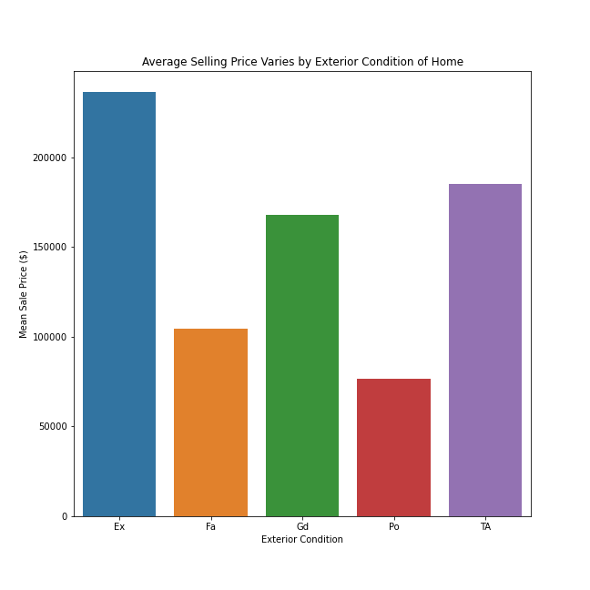

# Predicting the Price of a Home in Ames, Iowa

##  Problem Statement

[Home appraisals](https://www.investopedia.com/articles/pf/12/home-appraisals.asp) are almost always used in home purchase and sale transactions as well as in mortgage refinancing. Appraisers within a given financial institution will utilize the same [checklist](https://www.americanfinancing.net/mortgage-basics/home-appraisal-checklist) for conducting home value comparisons in a given area. This project aims to use linear regression to aid home appraisers in Ames, Iowa determine an accurate home value based on responses to the appraisal checklist used in the Ames, Iowa Housing dataset. 

## Background

Real Estate appraisal is a standardized practice in the home market. However, the correlation between [socioeconomic and demographic factors](https://www.nytimes.com/2020/08/25/realestate/blacks-minorities-appraisals-discrimination.html) on an appraiser's final evaluation for a home has recently lead to questions as to whether this practice is truly objective. My project aims to provide an an accurate and objective measure of a home's value for an appraiser to take into consideration when evaluating the price of a home.  

## Data 
[Ames, Iowa Housing dataset](http://jse.amstat.org/v19n3/decock/DataDocumentation.txt) provides a checklist of features home appraisers utilize to determine a home's final value along with the price the home sold at.
* 2051 samples and 81 Features in original dataset
* [Dataset source](https://www.kaggle.com/c/house-prices-advanced-regression-techniques/data) was from a Kaggle competition on predicting the price of a home. 
* The target value was home sale price. The target was predicted using linear regression. 
* [Data Dictionary](http://jse.amstat.org/v19n3/decock/DataDocumentation.txt)

* Home sale price distribution. From this histogram, I was able to identify that sale price needed to be power transformed for linear regression. 

* This bar chart highlights the importance of location on the sale price of a home. 

project-2
|__ code
|   |__ 01_EDA_and_Cleaning.ipynb   
|   |__ 02_Modeling.ipynb   
|   |__ 03_Conclusions_and_Recommendations.ipynb
|__ datasets
|   |__ train.csv
|   |__ test.csv
|   |__ output
|__ figures
|__ presentation.pdf
|__ README.md

## Summary
* EDA and Data Cleaning
    * Addressed outliers that were skewing the data. 
        * Improved the accuracy of my linear regression
    * Imputed values for null numerical observations
        * Median year for the garage_yr_blt and 0 for all other numerical values
        * Nulls in categorical values were addressed in one-hot encoding process
    * Evaluated whether power transforming sale price would improve regression
        * Yes, it increases the overall R2 of my predictors 
    * One-hot encoded categorical variables
        * Allowed me to perform linear regression analysis on them
* Pre-processing
    * Created interaction terms to make predictor matrix more rank efficient 
* Modeling
    * Created 6 unique models to identify optimized production model. 
    * Evaluated which model performed best with R2 and Root Mean Squared Error while taking into consideration performance (time taken to predict values). 
    * Determined that linear regression with lasso features was the most production ready model for home appraisers to use in real life due to its lower variance error and higher performance compared to the more accurate overfit linear regression. 

## Conclusions
|Model|R2|RMSE|
|---|---|---|
|Baseline|-0.0109|77569.287|
|Linear Regression|0.8717|27627.700|
|Overfit Linear regression|.9318|20146.007|
|Lasso Linear Regression|0.90409|23893.298|
|Ridge Linear Regression|0.9052|23755.216|
|Linear Regression (Lasso Features)|0.9304|20351.755|

* With an R2 of 0.9304 and a root mean squared error of 20351.76 dollars, I would recommend that home appraisers use my linear regression with lasso features model when considering the value of a home in the city of Ames, Iowa. 
    * The R2 tells us that 93%  of the variance in the price a home sells for is accounted for by my model.  
    * The root mean squared error of 20,351.76 dollars is only 11% of the mean home value in Ames, Iowa. 
    * Together, the statistics signify that my production model is a substantial asset to home appraisers when objectively identifying the value of a home.
    * Important caveats: 
        * Appraisers have to be using the same home appraisal checklist as the Ames, Iowa Housing dataset. 
        * This model was designed specifically for the city of Ames, Iowa. It cannot be generalized to other cities in Iowa, much less other states.  
        
* Important information for home appraisers
    * Location matters when appraising a home: you cannot justify the price of a home based on its inherent qualities alone. 

## Future Steps

I plan to generalize this model outside of Ames, Iowa by accruing more home appraisal information from a larger geographical region. In doing so, I could rely less on the particular local neighborhood locations when making my final my final prediction for home price. However, the company would need to be sure that they were going to continue using this home appraisal checklist as their standard for the near future because my model is restricted to predicting home price based on the exact features provided in this checklist.
Therefore, a more immediate next step would be to identify whether there is a better appraisal checklist the company could use for assessing home value. To determine this, I would build a separate model utilizing another company's checklist and determine whether I can achieve the same predictive accuracy at a similar level of efficiency. 
